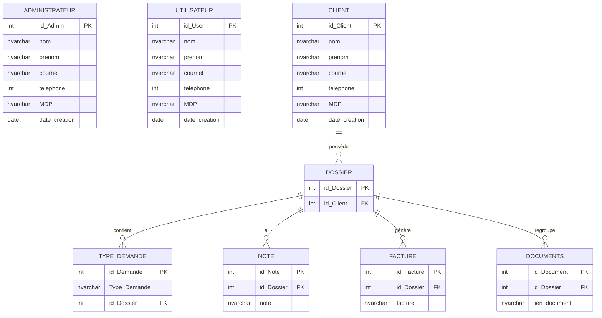

```mermaid 
erDiagram

    ADMINISTRATEUR {
        int id_Admin PK
        nvarchar nom
        nvarchar prenom
        nvarchar courriel
        int telephone
        nvarchar MDP
        date date_creation
    }

    UTILISATEUR {
        int id_User PK
        nvarchar nom
        nvarchar prenom
        nvarchar courriel
        int telephone
        nvarchar MDP
        date date_creation
    }

    CLIENT {
        int id_Client PK
        nvarchar nom
        nvarchar prenom
        nvarchar courriel
        int telephone
        nvarchar MDP
        date date_creation
    }

    DOSSIER {
        int id_Dossier PK
        int id_Client FK
    }

    TYPE_DEMANDE {
        int id_Demande PK
        nvarchar Type_Demande
        int id_Dossier FK
    }

    NOTE {
        int id_Note PK
        int id_Dossier FK
        nvarchar note
    }

    FACTURE {
        int id_Facture PK
        int id_Dossier FK
        nvarchar facture
    }

    DOCUMENTS {
        int id_Document PK
        int id_Dossier FK
        nvarchar lien_document
    }

    CLIENT ||--o{ DOSSIER : "possède"

    DOSSIER ||--o{ TYPE_DEMANDE : "contient"
    DOSSIER ||--o{ NOTE : "a"
    DOSSIER ||--o{ FACTURE : "génère"
    DOSSIER ||--o{ DOCUMENTS : "regroupe"
```